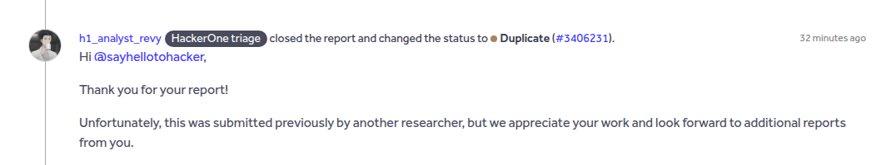
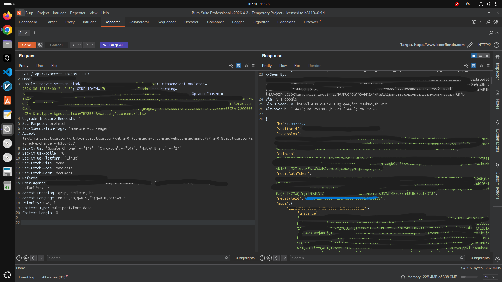
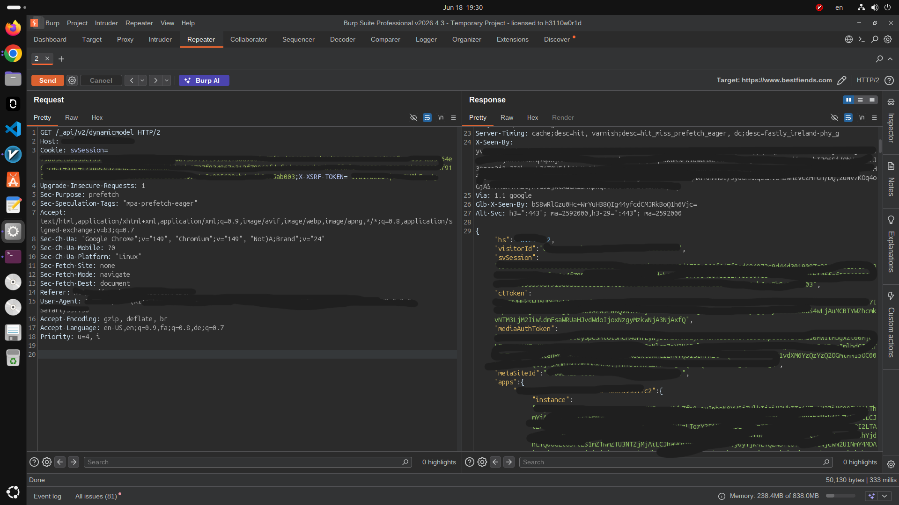

<p align="center">
  
  
  
</p>

<h1 align="center">🔓 Unauthenticated Session & App Token Leakage</h1>
<h3 align="center">Full Site Takeover via Wix API Endpoints</h3>

<br>

---

## 📌 Summary

A Wix-based production website exposes internal API endpoints that return **highly sensitive session tokens, access tokens for all installed applications, and a media upload token** — completely without authentication.

An anonymous attacker can:

- Harvest a valid server session (`svSession`) from a single GET request
- Reuse that session on other endpoints to **generate fresh tokens indefinitely**
- Gain **full account takeover**, access to **all app data**, and **unrestricted file upload** capability

---

## 🧠 How I Found It

While analyzing the client-side JavaScript source code, I extracted several internal API paths. One of them caught my attention:

```
/_api/v1/access-tokens
```

I fired up Burp Suite, sent a simple GET request as a **completely anonymous user** (the consent cookie literally said `isAnonUser=1`), and the server responded with... everything.

No `Authorization` header. No login. No tricks. Just a clean 200 OK with the keys to the kingdom.

---

## ⚙️ Technical Breakdown

### 🔑 Step 1 — Anonymous Token Harvest

**Request (Burp Repeater):**

- Method: `GET`
- Path: `/_api/v1/access-tokens`
- Auth: **None** — anonymous user with default cookies

**Response:** `HTTP/2 200 OK`

The JSON body contained:

| Token | Purpose | Risk |
|-------|---------|------|
| `svSession` | Server session token | 🔴 Full account impersonation |
| `accessToken` (30+ apps) | Per-app access tokens | 🔴 Read/write all app data |
| `mediaAuthToken` | JWT for file uploads | 🔴 Arbitrary file upload |
| `visitorId` | Unique visitor ID | 🟡 User tracking |
| `metaSiteId` | Site identifier | 🟡 Reconnaissance |
| `XSRF-TOKEN` | CSRF protection token | 🟡 CSRF bypass |

---

### 🔄 Step 2 — Session Reuse & Token Regeneration

To prove the session was real and usable, I took the stolen `svSession` and called a completely different endpoint:

**Request (Burp Repeater):**

- Method: `GET`
- Path: `/_api/v2/dynamicmodel`
- Cookie: `svSession=<stolen_value>`
- Header: `X-XSRF-TOKEN=<stolen_value>`

**Response:** `HTTP/2 200 OK`

The server returned the **exact same JSON structure** with **freshly generated access tokens**. This means:

- ✅ The session is fully functional
- ✅ The attacker can mint new tokens at will
- ✅ Access persists as long as the session stays alive

---

## 💥 Real-World Impact

**Full Account Takeover**
The stolen `svSession` allows complete impersonation of the site administrator. An attacker gains access to the Wix dashboard, site settings, billing, and all management functions.

**Complete App Data Breach**
With individual `accessToken` values for every installed app (30+), an attacker can read and modify user databases, configuration, secrets, and any data stored within those applications.

**Remote Code Execution via File Upload**
The `mediaAuthToken` enables uploading arbitrary files to the site's media service. This opens the door to web shells, malware distribution, or full site defacement.

**Persistent Backdoor Access**
Since fresh tokens can be regenerated from the stolen session repeatedly, an attacker maintains **long-term, undetectable access** without needing to re-exploit.

**Zero Barriers to Entry**
The entire attack requires nothing more than a single HTTP request. No accounts, no credentials, no user interaction — anyone on the internet can do it.

---

## 📊 Severity Justification

**CVSS 3.1 Vector:** `AV:N / AC:L / PR:N / UI:N / S:U / C:H / I:H / A:H`

| Metric | Value | Reason |
|--------|-------|--------|
| Attack Vector | Network | Exploitable over the internet |
| Attack Complexity | Low | One simple GET request |
| Privileges Required | None | Anonymous user |
| User Interaction | None | No victim action needed |
| Scope | Unchanged | Same security domain |
| Confidentiality | High | All tokens and data exposed |
| Integrity | High | Modify site and app data |
| Availability | High | Delete files, break site |

**Final Score: 9.8 — CRITICAL**

---

## 🕒 Disclosure Timeline

| Date | Event |
|------|-------|
| 18 June 2026 | Vulnerability discovered |
| 18 June 2026 | Full report submitted to the program |
| 19 June 2026 | Triaged — confirmed valid but duplicate |

<p align="center">
  
</p>

> The bug was acknowledged as a valid critical finding. It had been previously reported by another researcher.

---

## 📸 Proof of Concept

**Step 1 — Anonymous token leak (no auth required):**

<p align="center">
  
</p>

**Step 2 — Session reuse with token regeneration:**

<p align="center">
  
</p>

> ⚠️ All sensitive values have been redacted for security.

---

## 🛡️ Remediation

For Wix-based sites and Wix's security team:

- **Restrict public access** to `/_api/v1/access-tokens` — it must require a valid, authenticated admin session
- **Validate session ownership** on all `/_api/*` routes before returning sensitive data
- **Rotate all exposed tokens** immediately upon discovery
- **Audit the API routing layer** for other endpoints that may leak tokens anonymously

---

## 🏷️ Keywords

`Bug Bounty` `Wix` `Critical` `Broken Authentication` `Information Disclosure` `API Security` `Session Leakage` `Access Token` `Write-up` `HackerOne` `InfoSec` `Cybersecurity` `Penetration Testing` `CVSS 9.8`

---

## ⚠️ Disclaimer

This write-up is published for **educational and portfolio purposes only**. The affected website and all sensitive values have been redacted. No exploitation was performed beyond what was necessary to prove the vulnerability. The bug was reported responsibly through the appropriate channels.

---

<p align="center">
  <b>⭐ Found this useful? Give it a star!</b><br>
  <i>Connect with me on <a href="https://github.com/YOUR_USERNAME">GitHub</a></i>
</p>
